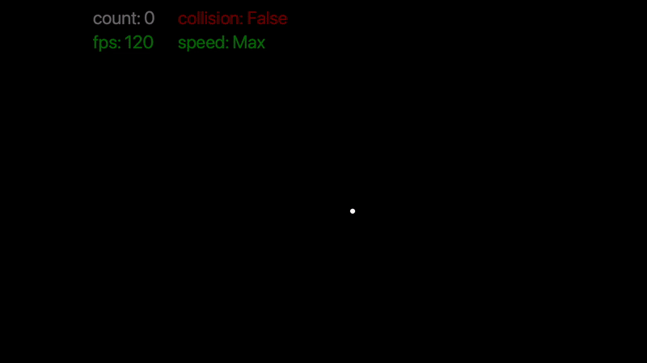

# Particles
Just a fun/visualy pleasing particles simulator using Processing.  FPS is low because i am saving every frames to make the video, otherwise runs at 120 FPS up until 500 particles when collision is off on my computer.

## Commands:

* "space": Add a particle
* "c": Toggle collision between particles
* "mouse press": Cancel the attraction of the particles towards the mouse while pressed
* "s": Toggle slow-motion (will drop the FPS from 120 to 30. Won't be noticeable if the simulation is already lagging and running close to 30FPS)
* "r": Reset particles count to 0
* "f": Freeze frame
* "h": Toggle info (particles count, FPS, speed, ...)
* "return": Toggle recording (records frames as .png)
